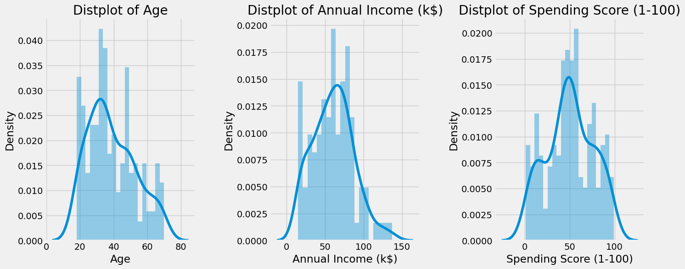
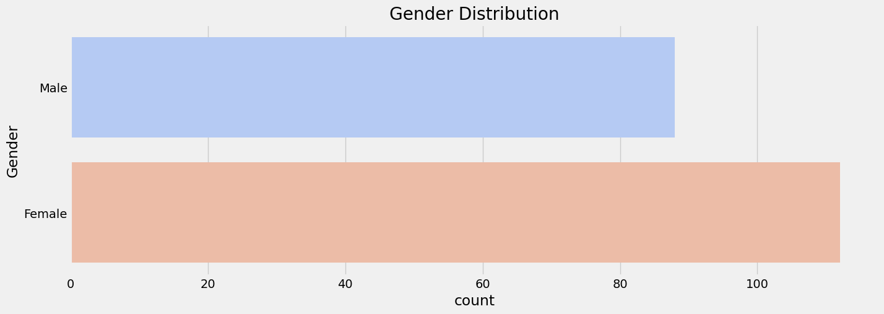
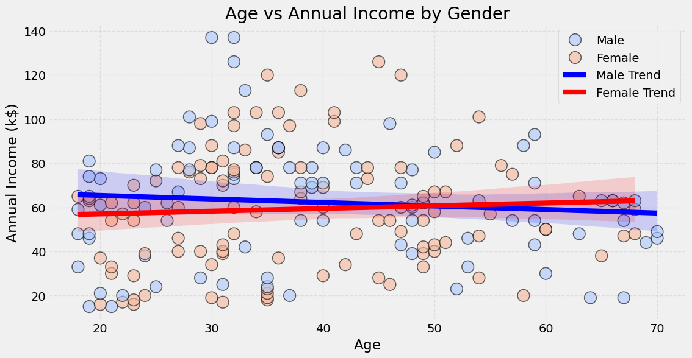
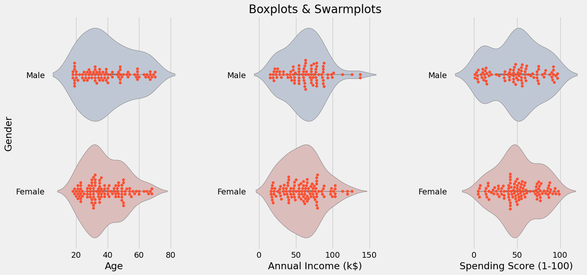
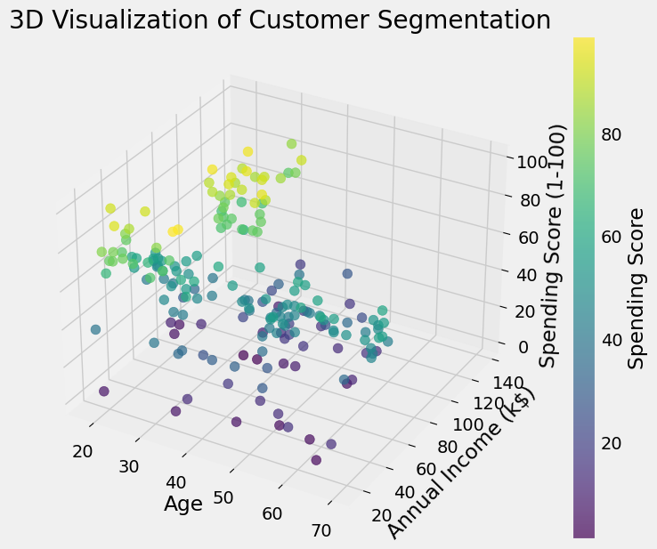
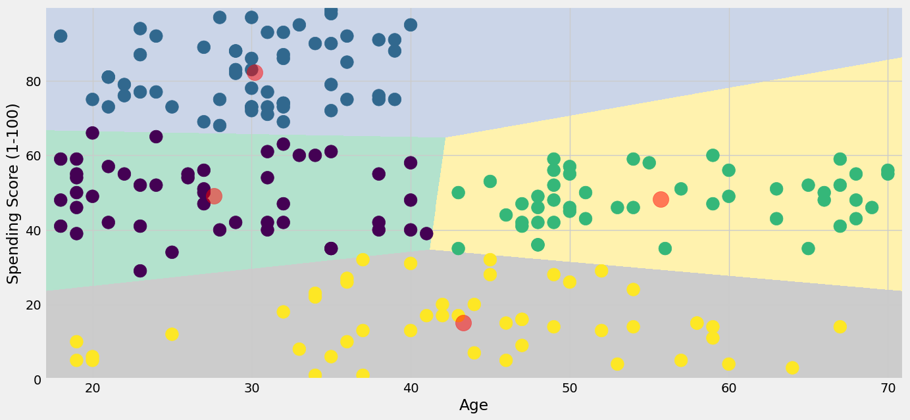
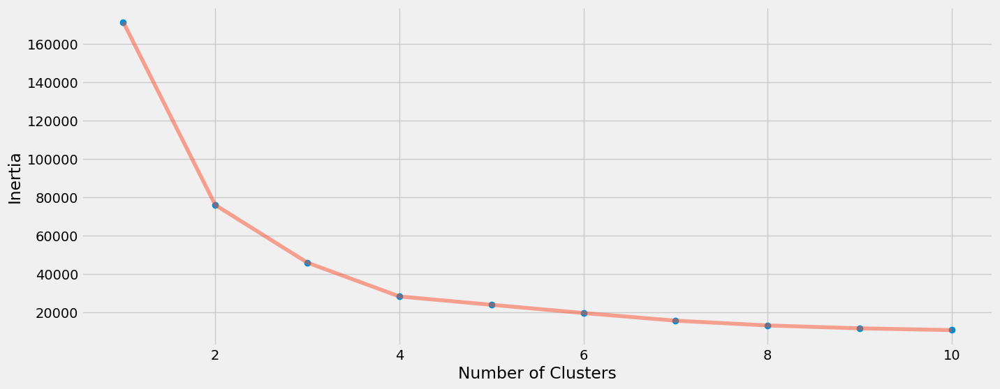
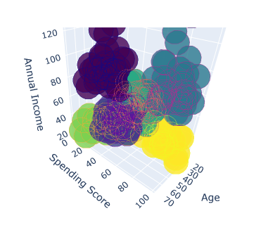

# Customer Behavior Analysis for Targeted Marketing Using K-Means

## Project Overview

This project applies K-Means clustering to segment customers based on demographic and spending behavior. The objective is to uncover distinct customer groups to enable highly targeted and effective marketing strategies. By transforming raw customer data into actionable clusters, this analysis helps businesses focus their marketing efforts, improve personalization, and enhance customer retention.

The outcome supports strategic decisions across marketing, sales, and product teams by delivering a clearer understanding of customer diversity and value.

---

## Visual Summary of Results

### Spending Score Distribution

  
Shows the distribution of customer spending scores. Helps identify general spending behavior patterns across the dataset.

---

### Customer Count by Gender

  
Displays gender representation among customers. Useful for understanding demographic composition.

---

### Age vs Spending Behavior

  
Illustrates the relationship between customer age and spending score, revealing generational behavior trends.

---

### Income-Based Segmentation

  
Demonstrates how income levels correlate with spending behavior—key for targeting high-income, high-spending segments.

---

### Clustered Customer Segments

  
Shows the distinct clusters formed by K-Means based on income and spending. Each cluster represents a unique behavioral segment.

---

### Cluster Visualization – 2D Scatter

  
A more detailed view of the K-Means output, helping interpret the boundaries and distribution of clusters.

---

### Age Trends Across Clusters

  
Line plot showing average age per cluster. Useful for tailoring age-specific marketing strategies.

---

### 3D Cluster Visualization

  
Interactive 3D plot displaying how income, spending score, and age contribute to cluster formation.

---

## Business Value & Strategic Applications

| Business Area        | Strategic Impact                                                                 |
|----------------------|-----------------------------------------------------------------------------------|
| **Marketing**        | Enables hyper-targeted campaigns based on behavioral segments.                   |
| **Product Development** | Informs product offerings aligned with needs of specific customer groups.      |
| **Sales Strategy**   | Identifies high-value customers for focused upselling or retention efforts.       |
| **Customer Experience** | Enhances personalization by understanding customer preferences more deeply.   |

These insights can drive smarter allocation of marketing budgets and improve ROI across customer acquisition and retention programs.

---

## Analysis Workflow

- **1. Data Loading & Preprocessing**  
  Imported and cleaned customer data for consistency and usability.

- **2. Exploratory Data Analysis (EDA)**  
  Explored demographics and purchasing patterns to detect natural groupings and trends.

- **3. Data Visualization**  
  Used plots to uncover patterns and correlations in spending, income, and age.

- **4. Clustering with K-Means**  
  Applied the K-Means algorithm to group customers into behaviorally distinct clusters.

- **5. 3D Visualization**  
  Built a multi-dimensional view for a more comprehensive understanding of cluster dynamics.

---

## Dataset Overview

The dataset consists of 2000 customer records, each with:

- **CustomerID**: Unique identifier  
- **Gender**: Male or Female  
- **Age**: Customer’s age  
- **Annual Income (k$)**: Income in thousands  
- **Spending Score (1–100)**: Assigned based on purchasing behavior (higher = more frequent spender)

---

## Key Findings & Insights

| Insight                                 | Business Implication                                                      |
|----------------------------------------|---------------------------------------------------------------------------|
| Distinct behavioral clusters identified | Enables customized marketing and communication strategies per segment.    |
| High-value cluster detected             | Indicates where to prioritize loyalty programs and retention efforts.     |
| Low-spending cluster with high income   | Represents untapped opportunity—consider targeted engagement initiatives. |
| Spending behavior varies by age group  | Suggests tailoring offers for different generational preferences.         |

---

## Tools & Technologies

- **Data Handling**:  
  - `Pandas`  
  - `NumPy`

- **Visualization**:  
  - `Matplotlib`  
  - `Seaborn`  
  - `Plotly`

- **Machine Learning**:  
  - `Scikit-learn (KMeans)`

- **Development Environment**:  
  - Jupyter Notebook

---

## Contact

For collaboration, consultation, or further insights, please reach out via [LinkedIn – Vedant Shinde](https://www.linkedin.com/in/vedantshinde25).
